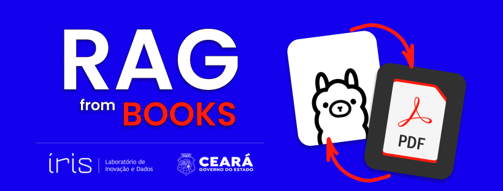

<h1 align="center">
  
</h1>

**RAG Books** é um projeto que utiliza a abordagem Retrieval Augmented Generation (RAG) para gerar conteúdo sobre tópicos de ciência de dados de forma automática. Seu propósito principal é criar materiais didáticos, como oficinas e bootcamps, a partir de fontes primárias como livros e artigos sobre ciência de dados. Este projeto foi utilizado para gerar as oficinas de ciência de dados do projeto "Cientista Chefe da Transformação Digital" do Governo do Estado do Ceará.

## Recursos:

- Geração automática de conteúdo: O projeto é capaz de gerar capítulos, seções e subseções sobre tópicos de ciência de dados com base em um contexto fornecido por fontes como livros e artigos.

- Abordagem RAG: Utiliza a abordagem Retrieval Augmented Generation, que combina recuperação de informações relevantes e geração de texto para produzir conteúdo coerente e informativo.

- Vetorização de documentos: Os documentos de origem (livros, artigos, etc.) são vetorizados e armazenados em um banco de dados vetorial (Chroma) para recuperação eficiente.

- Prompt Engineering: Utiliza técnicas de Prompt Engineering para guiar o modelo de linguagem na geração de conteúdo adequado para materiais didáticos.

- Modelos de Linguagem de Ponta: O projeto utiliza modelos de linguagem de última geração, como o LLaMA 3, para gerar texto de alta qualidade.

## Tecnologias

- [Python](https://www.python.org/)
- [Langchain](https://langchain.com/)
- [Chroma](https://www.trychroma.com/)
- [Ollama](https://ollama.com/)
- [Sentence Transformers](https://www.sbert.net/)
- [LLaMA3](https://llama.meta.com/llama3/)

## Instalação

1. Clone o repositório:

```bash
git clone https://github.com/damarals/rag-books.git
```

2. Instale as dependências:

```bash
cd rag-books
pip install -r requirements.txt
```

3. Prepare os dados:
   - Coloque os arquivos PDF e artigos que deseja utilizar como fonte de informação na pasta `data/books/`.
   - Atualize o arquivo `configs/config.yaml` com os caminhos corretos para os dados e o banco de dados vetorial.

4. Configure o Ollama:
   - Instale o [Ollama](https://ollama.com/).
   - Certifique-se de ter feito o pull dos modelos necessários (o padrão é `llama3`).
   - Inicie o backend executando `ollama serve`.

## Uso

#### Ingestão de documentos:

```bash
python src/ingest.py
```

Este comando irá processar os documentos (PDFs e artigos), dividi-los em pedaços (chunks), vetorizá-los e armazená-los no banco de dados vetorial (Chroma).

#### Gerar conteúdo:

```bash
python main.py "tópico" --mode módulo
```

Substitua `"tópico do livro"` pelo tópico sobre o qual deseja gerar o conteúdo e `módulo` pelo tipo de conteúdo desejado (módulo, capítulo ou subseção).

## Contribuição

Contribuições são bem-vindas! Sinta-se à vontade para abrir issues ou enviar pull requests para melhorar o projeto.

## Licença

Este projeto está licenciado sob a [MIT License](LICENSE).